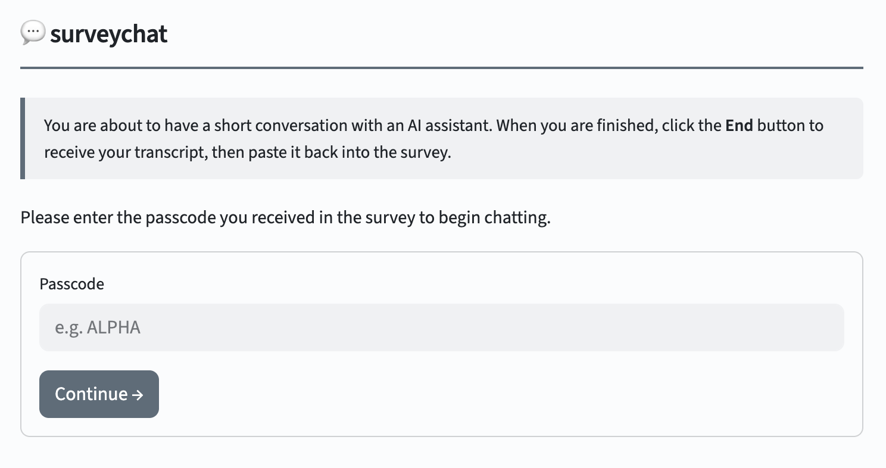

# Summary

`surveychat` is an open-source web application that enables researchers to administer surveys and conduct randomized experiments involving large language model (LLM)-based conversational agents, without the need to develop custom web application code. The system supports two primary operational modes: (i) **survey mode**, in which all participants interact with an identical chatbot configuration, and (ii) **experiment mode**, in which participants are randomly assigned to one of multiple chatbot conditions, each defined by a researcher-specified system prompt and model. Upon completion of the interaction, participants receive an anonymized JSON transcript that contains only the role, content, and timestamp of each message, without any associated condition or model metadata. This transcript can be copied back into the parent survey platform (e.g., Qualtrics), within which the chatbot interface itself can also be directly embedded. The frontend of `surveychat` is implemented using Streamlit, and the entire application is configured via a single Python file. The system does not persist conversation data on its server and is compatible with any chat-completions-compatible API endpoint - including locally hosted models - thereby allowing researchers to retain full control over model selection, API usage, data jurisdiction, and adherence to ethical and regulatory requirements.

# Statement of Need

Large language models (LLMs) have substantially expanded the methodological toolkit available to researchers across a wide range of disciplines. They enable the design and implementation of experiments in which participants engage with conversational agents whose communicative parameters can be manipulated with high precision - for instance, contrasting empathetic versus affectively neutral interviewing, directive versus exploratory questioning styles, or agents framed as domain‑specific experts versus generalists - and researchers can then systematically evaluate how these experimental manipulations affect response quality, patterns of self‑disclosure, and mechanisms of attitude formation. Empirical findings indicate that participants disclose information of comparable intimacy to chatbots and to human interlocutors, while reporting diminished fear of negative evaluation and similar levels of relief following disclosure [@croes2024digital]. Such emotionally laden disclosure to conversational agents can confer psychological and relational benefits that are on par with those observed in interactions with human partners [@ho2018psychological]. Convergent evidence further suggests that appropriately calibrated self‑disclosure by the agent itself can enhance participants’ empathy within these interactions [@tsumura2023influence].

Beyond randomized experiments, large language models also facilitate the replacement of static, text‑entry survey instruments with dynamic, dialogue‑based interfaces, in which a chatbot interviewer can pose clarifying follow‑up questions, probe ambiguous or incomplete responses, and adapt its behavior to the respondent’s contextual characteristics. Conversational virtual interviewers grounded in relational‑agent frameworks have been shown to sustain participant engagement across repeated contacts in longitudinal interventions [@bickmore2010maintaining], and experience‑sampling studies employing emotion‑aware chatbots illustrate how adaptive agents can support durable behavior change [@ghandeharioun2019towards]. This form of interactive flexibility is particularly advantageous for the collection of in‑depth qualitative data, wherein nuanced probing and context‑sensitive adaptation are critical for eliciting rich, high‑quality narratives.

Both use cases require robust software infrastructure for dialogue management, structured transcript capture, and (in experimental contexts) participant routing and assignment to experimental conditions. `surveychat` offers a fully functional, self-hostable platform that supports this entire workflow: researchers with basic proficiency in Python can configure and deploy a chatbot-based survey or a multi-arm chatbot experiment within minutes, and without the need to implement custom web-application code.

# State of the Field

Empirical investigations of conversational interviewing consistently indicate that adaptive, dialogic questioning formats improve response quality and attenuate measurement error when compared with standardized, fixed-format question designs [@schober1997does; @west2018nonresponse]. Concurrently, cross-mode comparisons suggest that, for sensitive domains, online audio, video, chat, email, and web survey modes tend to yield broadly comparable data quality, with logistical and practical considerations exerting greater influence than mode-specific effects [@oates2022audio]. The rapid development of large language model (LLM)-based chatbots introduces a scalable and widely accessible infrastructure for implementing such conversational survey interactions, thereby catalyzing an expanding body of empirical research on LLM-mediated survey instruments.

Despite increasing interest in this domain, practical open-source tools specifically designed to meet the methodological and operational requirements of survey researchers remain limited. Commonly used survey platforms, such as Qualtrics and Prolific, offer functionalities for branching logic and recruitment workflows but do not natively support large language model (LLM)-driven conversational interfaces. General-purpose LLM orchestration frameworks, including LangChain and LlamaIndex, provide infrastructure for prompt engineering but lack key features needed for empirical data collection, such as participant-facing user interfaces, robust mechanisms for transcript serialization, and logic for routing participants across experimental conditions. As a result, adapting these frameworks into fully functional research instruments requires substantial additional development at the application layer. The main alternative - developing fully custom, study-specific scripts - typically produces non-reusable, idiosyncratic solutions that are difficult to disseminate and standardize across research teams. Proprietary chatbot integrations, on the other hand, commonly obscure critical details such as the underlying model configuration and system prompts from investigators, thereby limiting transparency, methodological control, and reproducibility [@spirling2023open].

`surveychat` addresses this methodological limitation by encapsulating the complete participant interaction workflow - including passcode-based routing, large language model (LLM)–mediated dialogue, and export of structured JSON transcripts - within a single, configurable Python module. The system prompt, model identifier, and routing logic are maintained as version-controlled plain-text artifacts, thereby enabling precise experimental reproducibility and systematic auditability. Deployment options range from local deployments to containerized environments via Docker or dedicated cloud-based virtual machines, thereby accommodating heterogeneous scalability demands and regulatory or organizational compliance constraints.

# Design and Workflow

A `surveychat` study is implemented as a five-stage process:

1. **Configuration**: In the initial stage, the researcher specifies the experimental conditions by modifying the `CONDITIONS` list in `app.py`. Each element of this list defines a human-readable `name`, an optional `passcode` (only for experiments, not needed for surveys), a `system_prompt`, and a `model` identifier. Study-level parameters (`STUDY_TITLE`, `WELCOME_MESSAGE`, `PASSCODE_ENTRY_PROMPT`) are configured within the same code block, thereby establishing the global settings for the study environment.

2. **Participant routing**: In **survey mode** (`N_CONDITIONS = 1`), no routing logic is applied; all participants are directed without passcode to the same chat interface. In **experiment mode**, participant allocation is governed by one of two sub-modes. In *passcode routing* (activated when every condition specifies a `passcode`), participants are first presented with a passcode entry interface; the submitted passcode is resolved in a case-insensitive mapping to determine the experimental condition. This mapping is deterministic across page reloads, such that a given passcode consistently maps to the same condition without reliance on server-side session storage. In *random routing* (used when no passcodes are defined), an experimental condition is sampled from a uniform distribution upon the initial page load.

3. **Chat interaction**: Participants engage in dialogue with the chatbot via a minimalistic Streamlit-based user interface [@streamlit]. The system prompt is programmatically inserted at index 0 of every API request and remains hidden from the user interface at all times. Model outputs are delivered using token‑wise streaming to approximate a natural, turn‑taking conversational dynamic. To mitigate inadvertent termination of the interaction, we implement a two‑stage *End chat → Confirm* control scheme. These design decisions - specifically, response streaming and explicit end‑of‑session confirmation - are informed by prior research on sustaining user engagement with relational agents in repeated, survey‑like interaction contexts [@bickmore2010maintaining].

4. **Transcript export**: Upon completion of the conversation, the interface generates a JSON object containing a single `"messages"` array. Each element of this array includes the fields `role` (with possible values `"participant"` or `"assistant"`), `content`, and a UTC ISO 8601–formatted `timestamp`. Streamlit's native copy functionality enables one-click transfer of the complete transcript to the clipboard. In experimental conditions, the condition label and model identifier are deliberately excluded from the transcript to prevent participants from inferring their assigned experimental arm; treatment assignment is instead reconstructed from the passcode recorded within the original survey platform.

5. **Data ingestion**: Researchers process the transcript by parsing the JSON structure using standard libraries, for example in Python:

```python
import json, pandas as pd
data = json.loads(transcript_string)
df   = pd.DataFrame(data["messages"])  # one row per conversational turn
```

Or in R:

```r
library(jsonlite)
data <- fromJSON(transcript_string)
df   <- as.data.frame(data$messages)
```

During system initialization, a series of configuration validation procedures is executed. These procedures detect missing API credentials, inconsistencies in `N_CONDITIONS` declarations, partially specified condition lists, redundant passcode assignments, and empty passcode fields. Any such issues generate explicit, actionable error messages prior to the rendering of any participant-facing user interface components.

{ width=95% }

{ width=95% }

The passcode routing mechanism is implemented to align with mainstream survey workflows like Qualtrics. In this setup, participants are randomly assigned to experimental conditions within Qualtrics. A condition-specific code is then displayed on a survey page, and participants are directed to the `surveychat` URL. The chatbot can be embedded as an iFrame directly within the Qualtrics survey page, allowing participants to interact with it without exiting the survey interface. Upon completion of the chatbot interaction, participants copy the resulting JSON transcript into a Qualtrics text-entry question, thereby consolidating treatment assignment and outcome data within a single data export.

{ width=100% }

# Research Impact

Emerging empirical evidence comparing large language model (LLM)-based conversational interviewers with human interviewers indicates that AI-administered interviews can yield data of comparable quality while offering substantially greater scalability [@wuttke2025ai]. `surveychat` was developed to support ongoing research programmes in survey methodology and experimental social science at the University of Amsterdam. A publicly accessible, two-condition demonstration experiment - contrasting a neutral with an empathetic chatbot interviewer - has been implemented and made available to external users. The system’s design was iteratively refined based on feedback from survey-methodology researchers who required LLM-based instruments that integrate seamlessly with Qualtrics-centered experimental workflows. The project is intended to be reusable across a wide range of social-science domains in which controlled conversational experiments or chatbot-mediated structured interviews are required.

# References
